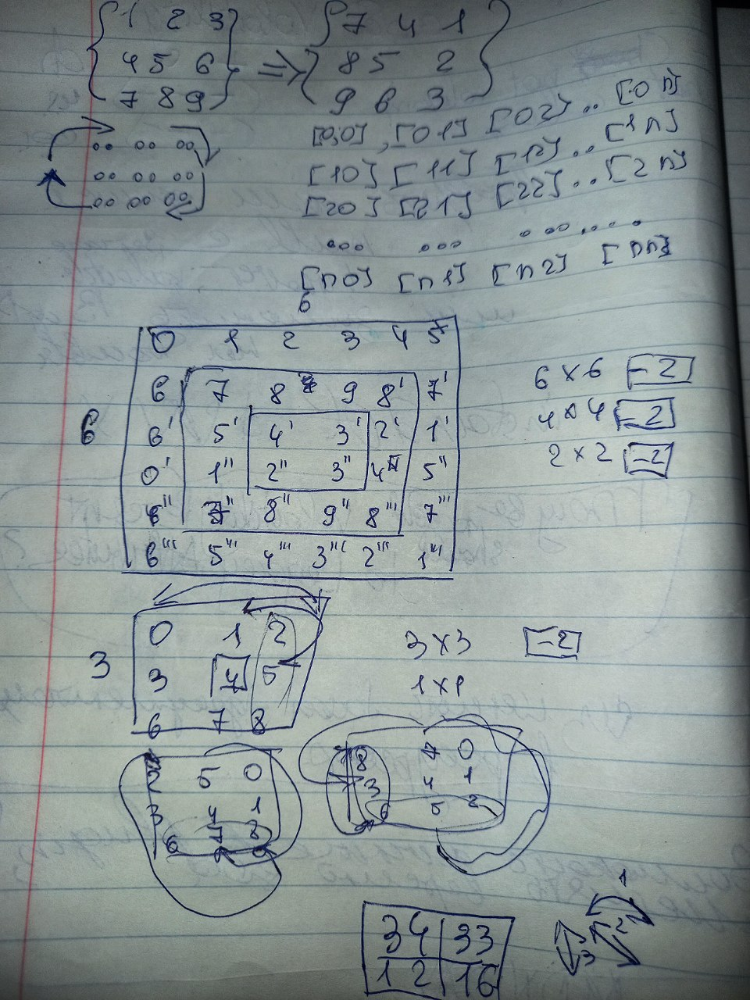

## Rotate image

You are given an n x n 2D matrix representing an image, rotate the image by 90 degrees (clockwise).

You have to rotate the image in-place, which means you have to modify the input 2D matrix directly. DO NOT allocate another 2D matrix and do the rotation.

### Implementation logic:
Implementation logic: the algorithm correctly shifts for n-dimension.

Divide the matrix into levels of squares. Rotate each square separately. It starts from the outside, getting deeper and deeper with each iteration.

Before starting the calculation - count the number of necessary iterations according to the formula: [ N / 2 ]. This action will guarantee the miscalculation of the last square (2x2) or the omission of the last element (1x1).

The fundamental side is taken from the top side, from which everything starts. Then the offset relative to the right, then the bottom, then the left sides. After these - full shift is done.

Helper file: [Example of shifting.pdf](Example%20of%20shifting.pdf) "PDF file with example of shifting")

_**My Draft:**_

